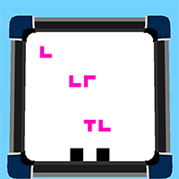

# oculoenv
Oculomotor task environments.

Task contents are mostly compatible with [Psychlab](https://arxiv.org/abs/1801.08116).

## Tasks

### Point to taget


### Visual search



### Odd one out


### Multiple object tracking


# Example

```python
import numpy as np
from oculoenv import PointToTargetContent, Environment

content = PointToTargetContent(target_size="small",
                               use_lure=True,
                               lure_size="large")
env = Environment(content)

for i in range(100):
    dx = np.random.uniform(low=-0.02, high=0.02)
    dy = np.random.uniform(low=-0.02, high=0.02)
    action = np.array([dx, dy])
    obs, reward, done, _ = env.step(action)

    if done:
        print("Episode terminated")
        obs = env.reset()
```

# Acknowledements

Some of the Opengl related code fragments are from [gym-duckietown](https://github.com/duckietown/gym-duckietown/).

